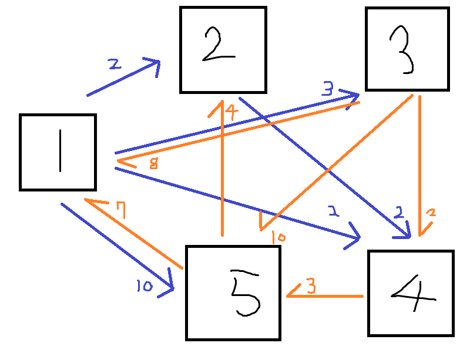

# 플로이드 알고리즘
모든 정점 쌍의 최단 거리를 구하는 알고리즘  

### 주어진 노선


**초기 최단 거리 테이블**
||||||
|:---:|:---:|:---:|:---:|:---:|  
0 | 2 | 3 | 1 | 10
0 | 0 | 0 | 2 | 0  
8 | 0 | 0 | 1 | 1  
0 | 0 | 0 | 0 | 3  
7 | 4 | 0 | 0 | 0  

ex) 1에서 2로 가는 최소 비용 : 2

2에서 3을 가려면 2 4 5 1 3 의 순서로 15의 비용으로 이동할 수 있다.
<br>
<br>
<br>
**갱신된 최단 거리 테이블**
||||||
|:---:|:---:|:---:|:---:|:---:|  
0| 2| 3 |1 |4
12 |0 |15| 2| 5
8 |5 |0 |1 |1
10 |7|13 |0 |3
7 |4|10| 6 |0

<br>
<br>
<br>

### Q) 그럼 어떻게 구현하는가?

한 곳을 거쳐 도착하는 노선을 새로 만들어주는 것이다!

예를 들어 2에서 5를 가려면 4를 거쳐 2 4 5 의 순서대로 이동한다.  
그럼 2 - 5의 (가상) 노선이 새로 생성됐다고 볼 수 있다.

그렇다면 2에서 3으로 이동하는  2 4 5 1 3 노선은 어떻게 구현하는가?

거쳐가는 정점을 1 ~ n 순서대로 갱신해준다고 생각하면  
우선 1을 거쳐가는 노선 5 1 3 이 5 - 3 으로 갱신되었다.  
그 다음 4를 거쳐 가는 노선 2 4 5 가 2 - 5 로 갱신된다.  
마지막으로 5 를 거쳐가는 2 5 3 이 이어지게 되면서 2 4 5 1 3 의 최단 노선을 갱신할 수 있다.

```
# 정점 개수
n = int(input())
# 노선 개수
m = int(input())

# 최단 거리 테이블
arr = [[0] * n for _ in range(n)]
for _ in range(m):
    y, x, k = map(int, input().split())
    if arr[y - 1][x - 1]:
        arr[y - 1][x - 1] = min(arr[y - 1][x - 1], k)
    else:
        arr[y - 1][x - 1] = k

# 최단 거리 갱신
for k in range(n):  # n번 정점을 거쳐가는
    for i in range(n):  # 출발 정점
        for j in range(n):  # 도착 정점
            # 출발 도착이 같으면 이동하는게 아님
            if i == j or i == k or j == k:
                continue
            # 거쳐갈 수 없으면 패스
            if arr[i][k] == 0 or arr[k][j] == 0:
                continue

            # 테이블 갱신
            if arr[i][j] == 0:  # 노선이 없는 경우
                arr[i][j] = arr[i][k] + arr[k][j]
            else:  # 노선이 있지만 돌아가는게 더 빠를 경우 갱신
                arr[i][j] = min(arr[i][j], arr[i][k] + arr[k][j])

for i in range(n):
    print(*arr[i])
```

<br>
<br>
<br>

### 경로도 저장하고 싶다면?

경로 테이블을 새로 만들다.

**초기 경로 테이블**

||||||
|:---:|:---:|:---:|:---:|:---:|  
0 |1| 2| 3| 4
0 |0 |0 |3 |0
0 |0 |0 |3 |4
0 |0 |0 |0 |4
0 |1 |0 |0 |0


**갱신된 경로 테이블**

||||||
|:---:|:---:|:---:|:---:|:---:|  
0| 1| 2| 3| 2
3| 0| 3| 3| 3
0| 4| 0| 3| 4
4| 4| 4| 0| 4
0| 1| 0| 1| 0

초기에 2 - 1 의 경로가 없었지만 갱신된 경로에선 4(3으로 표시)로 갈 수 있다.  
그럼 4 - 1 을 살펴보자. 5로 갈 수 있다.  
다음은 5 - 1 을 살펴보자. 직통 노선이 있다.  

즉 2 - 1 로 가려면 2 4 5 1 의 경로로 이동할 수 있음을 이 테이블에서 도출해낼 수 있다.
<br>
<br>

**구현 방법**  

거쳐갈 수 있는 정점을 표시해 주면 된다.  
예를 들어 1 - 2 는 2 (1으로 표시)가 테이블에 저장되어있다.  
즉 직통으로 갈 수 있는 경로라는 표시다.

3 - 2 의 경우를 보자.
5 (4으로 표시)가 테이블에 저장되어있다.  
그럼 현재 경로 상태는 3 - 5 - ? 이다.  
그럼 다음은 5 - 2 를 살펴보면 된다.  
5 - 2 에는 2 (1으로 표시)가 저장. 거치는 경우가 없다(도착)라는 의미이므로 종료.  
따라서 3 - 5 - 2 의 경로로 도착한다라는 걸 테이블에서 도출해낼 수 있다.  


```
n = int(input())
m = int(input())
arr = [[0] * n for _ in range(n)]
nxt = [[0] * n for _ in range(n)]

for _ in range(m):
    y, x, k = map(int, input().split())
    nxt[y - 1][x - 1] = x - 1
    if arr[y - 1][x - 1]:
        arr[y - 1][x - 1] = min(arr[y - 1][x - 1], k)
    else:
        arr[y - 1][x - 1] = k

for k in range(n):
    for i in range(n):
        for j in range(n):
            # 이동이 아닌 경우 제외
            if i == j or i == k or j == k:
                continue
            # 중간 노선이 이어지지 않는 경우 제외
            if arr[i][k] == 0 or arr[k][j] == 0:
                continue
            # 가상 노선 비용 (거쳐서 이동하는 노선)
            if arr[i][j] == 0:
                arr[i][j] = arr[i][k] + arr[k][j]
                if nxt[i][k] != k:
                    nxt[i][j] = nxt[i][k]
                    continue
                nxt[i][j] = k
            elif arr[i][j] > arr[i][k] + arr[k][j]:
                arr[i][j] = arr[i][k] + arr[k][j]
                if nxt[i][k] != k:
                    nxt[i][j] = nxt[i][k]
                    continue
                nxt[i][j] = k

# 경로 출력 ( 개수, 경로)
for i in range(n):
    for j in range(n):
        if arr[i][j]:
            ni = i
            tmp = [i + 1, nxt[i][j] + 1]
            while nxt[ni][j] != j:
                ni = nxt[ni][j]
                tmp.append(nxt[ni][j] + 1)
            print(len(tmp), *tmp)
        else:
            print(0)
